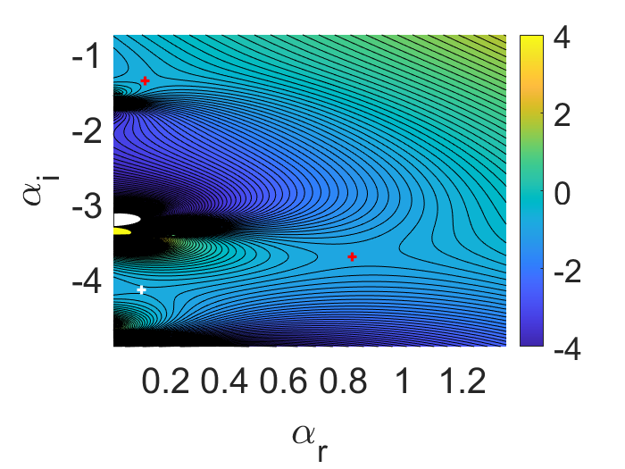
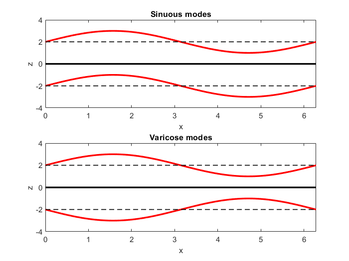

<!-- <html> -->
<head>

  <!-- body{overflow-x: hidden}  -->
</head>

<body>

<h1> </h1>
<h1 style="text-align: center;"> Abstract </h1>
A spatio-temporal stability analysis is conducted on a flow representing both jets and wakes, subject to confinement by identical compliant walls. The walls are placed at equal distances from the fluid centre line for a range of wall and flow parameters. By following the position of special saddle points (pinch points) of the dispersion relation in the complex wavenumber plane, the absolute and convective instability stability properties of the flow are determined for various system parameters. The compliant walls are shown to modify the flow-based instabilities, which exist in the rigid wall case, as well as introduce new additional instabilities originating from the presence of the wall itself. It is observed that under certain system parameters, these wall modes become the dominant instability present in the system and can induce an absolute instability into flows which are only convectively unstable when confined by rigid walls, as well as extending the region of absolute instability to large confinement parameters. Results are presented for both a piecewise linear velocity profile and a smooth velocity profile, with the results of the two studies in qualitative agreement. 
<h1> </h1> 

A link to the poster can be found here: <a href="Main_Poster (1).pdf">Poster.</a>

<h2 style="text-align: center;"> (1,2,3) The Dispersion Relation, Spatio-temporal Analysis, & Absolute Instability </h2>

 A dispersion relation is an expression which relates a waves wavenumber, usually denoted as \(\alpha\), which represents the number of wavelengths per unit of distance and the frequency \(\omega\), which represents the number of oscillations per unit time. There are a number of ways in which one can derive a dispersion relation, though this is not something we will derive here, though we recommend the book [1]. A dispersion relation is often written in the form 
\[\mathbb{D}(\alpha,\omega) \equiv 0. \] 
With this dispersion relation, one can carry out a number of instability analyses, including a temporal instability, i.e. where \(\omega \in \mathbb{C},\alpha \in \mathbb{R}\), allowing us to see how a wave can grow in time, or a spatial instability, where \(\omega \in \mathbb{R},\alpha \in \mathbb{C}\), which allows us to consider the growth of a wave in space. 
 

 Now what would we find out if we were to let both \(\alpha,\omega \in \mathbb{C}\)? By doing this, we are able to carry out a spatio-temporal analysis on the system. But what does this mean, and how does it differ from a spatial or temporal instability? 
 

 Unlike a spatial or temporal analysis, which consideres the growth of individual waves, a spatio-temporal analysis considers the growth of wave packets, groups of waves, after a suitably long time has passed. Furthermore, this analysis allows us to see whether a system experiances growth both up and downsteam of the initial disturbance, and growth in time. These modes, \((\alpha,\omega)\) pairs, are solutions of: 

\[\mathbb{D}(\alpha,\omega) = \frac{\partial\mathbb{D}(\alpha,\omega)}{\partial \alpha} = 0,\]

and take the form of saddle points in complex \(\alpha\)-plane, shown in Fig.1, and branch points in the complex \(\omega\)-plane. These points are refered to as pinch points and can be differenciated from regular saddle points using Briggs' Criterion [2]. Regular saddle points do not contribute to the instability, while pinch points do. For more details on distinguising these pinch points, consider the works of Juniper, cited on the poster.
 

<figure>
  
  <figcaption>Fig.1: Contours of constant \(\omega_{i}\) in the complex wavenumber plane. Red crosses indicate pinch points, while the white cross indicates a standard saddle point.</figcaption>
</figure>

 From a spatial-temporal analysis, we could have one of three outcomes: Stability, Convective Instability (CI) or Absolute Instability (AI). If we have a CI, then we have decay in time and growth in space. This is effectively a spatial instability. We have an AI if we see growth in time at a given pinch point, i.e. when \(\omega_{i} >0\). It is these modes that we are most interested in. 

 

<h2 style="text-align: center;"> (4,5,6,7) Flow Setup </h2>

 In our study, we used a piecewise linear base flow for our jet/wake. This flow consists of three layers of inviscid fluid, with fluid interfaces at \(z = \pm 1\). The outer two flows have idental constant velocity, say \(U_{2}\), while the inner flow has constant velocity \(U_{1}\). If the inner flow moves faster than the outer flow, we have a jet, otherwise we have a wake. An advantage of using this flow profile is that it allows us to write down explicit dispersion relations for our flow, where we would otherwise have to calculate modes of instability numerically if we were to consider a smoother flow profile. 

 Before we continue with our discussion of the base flow and definind our dispersion relation, we should first discuss what we mean by dimensionless variables, such as the wall parameters \(m,d,B,T,K\), and the flow parameters \(\Lambda,h\). Therse variables have no dimensions associated them, they are just numbers. This is a branch of mathematics called <a href="https://en.wikipedia.org/wiki/Dimensional_analysis">Dimensional Analysis.</a> 

Nondimensionalising a system has many advantages over using dimensional values. Firstly, we do not need to worry about units, like metres per second, or centimetres and such, as these are removed from the discussion. Furthermore, this method allows us to compare to the results of others, as long as we keep the dimenionless scheme consistent. 

At the end of the day, for the sake of this poster, all you need understand is that \(m,d,B,T,K\) represent various characteristics of the wall, while \(\Lambda\) represents the difference between the inner and outer flows, i.e. the shear, with \(\Lambda &gt; 0\) representing a jet, while \(\Lambda &lt; 0\) represents a wake. The larger the value of \(|\Lambda|\), the stronger the greater the difference between the inner and outer flow velocities. Finally, \(h\) represents how far away the outer walls are from the fluid interfaces. 

 Becuase of the symmetry of the flow down the fluid center, \(z = 0\), we can consider both symmetric and anti-symmetric flows independently of each other, though in reality we would see some combination of both these modes in the flow. Below we have the \(X^{(v,s)}\) and \(Y^{(v,s)}\) terms that make up the full dispersion relations, for varicose modes we have: 

\[X^{v} = F\coth(\alpha h)+G\coth(\alpha),\]

\[Y^{v} = F+G\coth(\alpha)\coth(\alpha h).\] 

And sinuous modes

\[X^{s} = F\coth(\alpha h)+ G\tanh(\alpha),\]

\[Y^{s} = F+G\tanh(\alpha)\coth(\alpha h),\] 

where \(F = (\alpha (1-\Lambda)-\omega)^{2}\) and \(G = (\alpha (1+\Lambda)-\omega)^{2}\).

Now what do we mean by symmetric and anti-symmetric modes? Well, note that the fluid interfaces can carry their own waves, represented by dashed black lines and red curves respectively in Fig.2. If the waves at the upper and lower interface are in phase with each other, than we have anti-symmetric, or sinuous modes. When these waves are out of phase, we have symmetric or varicose modes For more on this, see references on the poster. 

 

<figure>
  
  <figcaption>Fig.2: Difference between Sinuous and Varicose modes.</figcaption>
</figure>

Due to these fluid interfaces, the dominant instability that we see in this particular flow configuration is of 'Kelvin-Helmholtz' type. Examples of this form of instability can be found <a href="https://en.wikipedia.org/wiki/Kelvin%E2%80%93Helmholtz_instability">here</a>. These modes of absolute instability lead to a phenomena called vortex shedding, which can then lead to a global instability, effecting the entire flow. 

<h2 style="text-align: center;"> Future Work </h2>

In the future, we intend to break the symmetry of the flow, that is, we could either place the walls ar different distances from the flow centreline, or we could let the walls be non-identical in their behaviour. This could result in a flow with one rigid wall and one compliant wall, for example. 

By allowing the walls to be placed at different distanced away from the flow centreline, we will be able to highlight the influence of both asymmetry on the flow stability, but also the effects of a single compliant wall on the system. Removal of one wall, could remove stabilizing features that two walls are able to provide, leading to enhanced instability. Similar behaviour might be seen for when we take the walls to be non-identical, due to the different (de)stabilizing characteristics of each boundary.

Finally, we would like to consider the effect of viscosity on this flow. By considering viscosity in the problem, we introduce boundary layers at each of the confining walls. It has been shown in the rigid wall case by Rees and Juniper [3] that at strong confinement, these boundary layers have a stabilizing effect on the flow, while at weaker confinement, this stabilization effect is not so pronounced. It would therefore be useful for us to know if these same effects are seen when the confining walls are compliant, or even if the symmetry of the flow has been broken.

<h2 style="text-align: center;"> References </h2> 

1. P. G. Drazin. Introduction to hydrodynamic stability, volume 32. Cambridge University Press, 2002.  
2. Briggs, Richard J, Electron-stream interaction with plasmas, MIT, 1964. 
3. Rees, SJ and Juniper, MP, The effect of confinement on the stability of viscous planar jets and wakes, volume 656, Cambridge University Press, 2010.

<h2 style="text-align: center;"> Acknowledgements</h2> 

A big thanks goes to Dr Matt Turner for his support and guidence throughout this project. 