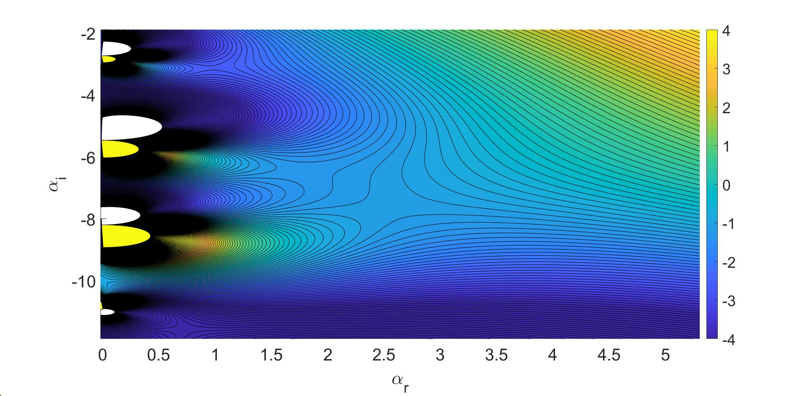

<!-- <html> -->
<head>

</head>

<body>
<h1> </h1>
<h1 style="text-align: center;"> Abstract </h1>
A spatio-temporal stability analysis is conducted on a flow representing both jets and wakes, subject to confinement by identical compliant walls. The walls are placed at equal distances from the fluid centre line for a range of wall and flow parameters. By following the position of special saddle points (pinch points) of the dispersion relation in the complex wavenumber plane, the absolute and convective instability stability properties of the flow are determined for various system parameters. The compliant walls are shown to modify the flow-based instabilities, which exist in the rigid wall case, as well as introduce new additional instabilities originating from the presence of the wall itself. It is observed that under certain system parameters, these wall modes become the dominant instability present in the system and can induce an absolute instability into flows which are only convectively unstable when confined by rigid walls, as well as extending the region of absolute instability to large confinement parameters. Results are presented for both a piecewise linear velocity profile and a smooth velocity profile, with the results of the two studies in qualitative agreement. 
<h1> </h1> 

<h1 style="text-align: center;"> Flow Setup and Dispersion Relataion </h1>

As discussed in the poster, our wall consists of an elastic plate which is in turn connected to a rigid backplate by a series of identical springs, between which there is a viscous fluid substrait. (add a diagram). This form of wall is refered to as a Kramer type compliant wall, as these were initially designed in the 1980s (check) by Kramer, who wished to understand the effects of dolphin skin on the transition to turbulence. His experiments ended up being controversial for a number of reasons, one being that they did a poor job at modelling dolphin skin in the first place. However these walls allow for some interesting behaviour in hydrodynamic problems. 

Now looking at Fig. 1, one may argue that this flow setup is not realistic either, since when in reality do we see these discontinuities of our base flow \(U(z)\) at \(z = \pm 1\)? Well, as it turns out, the shape of the base flow does not have a significant influence on the stability of the flow, meaning we can use this rather simple approach, and still get reasonable predictions for the flows instability. Another advantage of using this 'plug flow' profile, is that we can actually write out an explicit dispersion relation for our flow, as is written out in Eqn 1.
 

Since our flow is symmetric down the flow centre-line \(z = 0\), we can consider symmetric and anti-symmetric modes. In the poster we only disuss symmetric, or varicose modes. Anti-symmetric, or sinuous modes only differ by replacing the \(\coth(\alpha)\) terms in \(X^{v}\) and \(Y^{v}\) with \(\tanh(\alpha)\).

Does the below work? 

 \[ \int^{1}_{0} \exp(x) dx \] 

(Discuss the dimensionless parameters a bit more?)
<h1> </h1>
<h1 style="text-align: center;"> AI Analysis </h1>

The study of Absolute instability revolves around looking for specific saddle points in the complex $\alpha$-plane, whose corresponding growth rate, \(\omega_{i}\) is greater than zero. An example of such saddles can be seen below, where we take our walls to be rigid, with \(\Lambda=h=1\). 

<!-- [alt text](Merge_saddles.jpg) -->

  
 
<!-- br is a line break  -->

As stated on the poster, not every saddle represents an AI. Those that do are referred to as pinch points.We use Briggs' criterion to pick out these points, and we ignore the remaining saddles, unless these too become pinch points later down the line. 

We stated that the addition of compliant walls leads to both the stabilization and destabilization of the flow, based on the growth rates of these pinch points. Below is an example of how compliant walls at various confinement values actually influence the instability of the flow.   

<h1> </h1>
<h1 style="text-align: center;"> References </h1>
<!-- a note on the nondimensionalisation  -->

</body>
<!-- </html> -->
